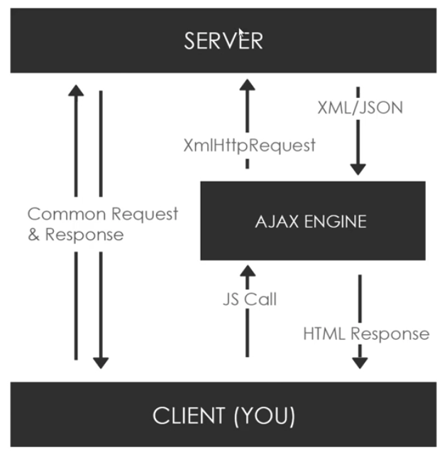

## What is AJAX?

- Asynchrnous JavaScript & XML
- Set of web technologies
- Send & receive data asynchornously
- Does not interfere with current webpage
- JSON has replaced XML for the most part

## How AJAX works

## XmlHttpRequest (XHR) Object

- API in the form of an object
- Provided by the brower's JS environment
- Methods transfer data between client/server
- Can be used with other protocols than HTTP
- Can work with data other than XML (JSON, plain text)

## Libraries & Other Methods

- jQuery
- **Axios** (HTTP client library. Slim and simple to use)
- Superagent
- **Fetch API** (Part of the browser, implementd in browser)
- Prototype
- Node HTTP

#### Using libraries are great!

_But_, you must need to know how to make a request using **Vanilla JavaScript first!** :)

## HTTP Statuses

- 200: "OK"
- 403: "Forbidden"
- 404: "Not Found" _404 status is not an error. It is a valid response._

## readyState Values

0: request not initialized 
1: server connection established 
2: request received 
3: processing request 
4: request finished and response is ready 
